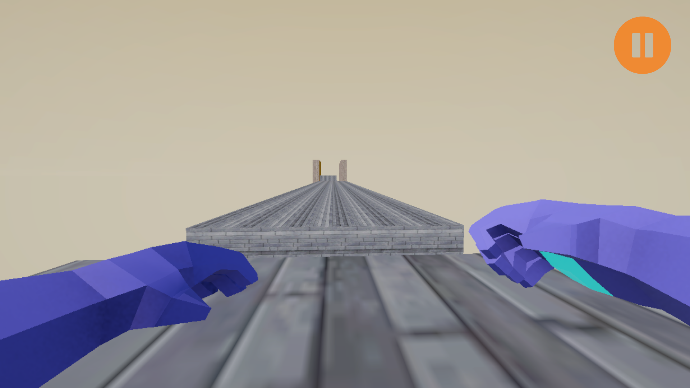
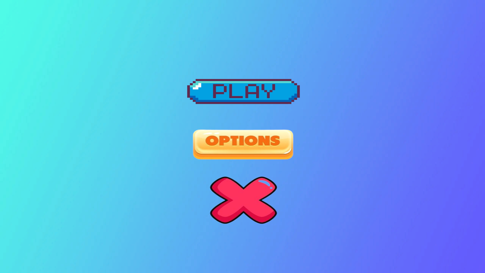
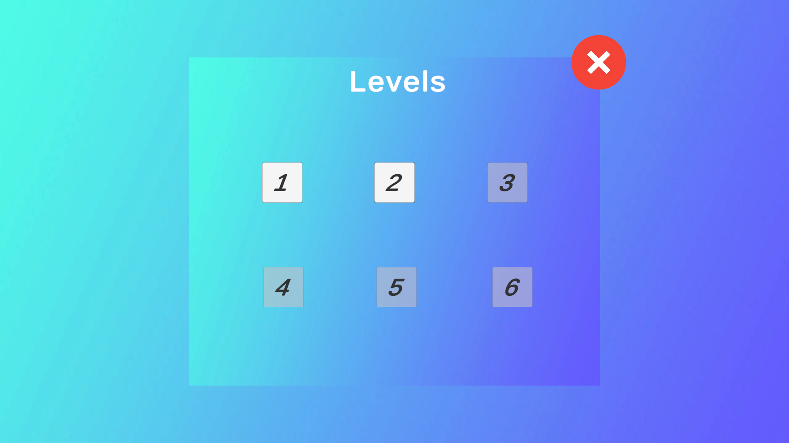

# FreeFall 🏃‍♂️⚡

FreeFall is a fast-paced **first-person parkour game** made in Unity. The game focuses on fluid movement, traversal, and overcoming obstacle-based levels using mechanics such as sprinting, sliding, wall running, wall jumping, and double jumping.

The goal is to complete each level by navigating through challenging parkour environments and reaching the level completion point.

---

## 🎮 Features

- First-person parkour movement
- Walking and sprinting
- Sliding with momentum
- Wall running
- Wall jumping
- Double jumping
- Moving platforms
- Multiple obstacle-based levels
- Level completion system
- Level unlocking system
- Main menu and level selection
- Pause menu
- Death screen with retry functionality
- Background music
- Music volume control
- Persistent volume settings
- Custom game UI

---

## 🕹 Controls

| Key               | Action                    |
| ----------------- | ------------------------- |
| W                 | Move Forward              |
| S                 | Move Backward             |
| A                 | Strafe Left               |
| D                 | Strafe Right              |
| Left Shift        | Sprint                    |
| Space             | Jump / Double Jump        |
| Left Alt          | Slide                     |
| E                 | Interact / Finish Level   |
| Esc               | Open / Close Pause Menu   |

---

## 🛠 Built With

- Unity
- C#
- Universal Render Pipeline (URP)

---

## 🎯 Goal of the Project

This project was created for learning and experimenting with first-person movement and parkour mechanics:

- First-person controller development
- Sprinting and sliding mechanics
- Wall running and wall jumping
- Double-jump implementation
- Momentum-based movement
- Moving platform mechanics
- Level design and obstacle placement
- Scene management and level unlocking
- UI and menu design
- Audio management and persistent settings

---

## 🗺 Levels

FreeFall currently contains **6 playable levels**, each designed with different obstacles and parkour challenges.

The player must complete the current level to unlock the next level.

---

## ⏸️ Game Systems

### Pause Menu

Press **Esc** to open or close the pause menu.

The pause menu provides options to:

- Resume the game
- Restart the current level
- Return to the main menu

### Death System

If the player falls from the level, a death screen appears with an option to retry the current level.

### Level Unlocking

Completing a level automatically unlocks the next level in the level selection menu.

---

## 🔍 Preview

### Gameplay Screenshot

### Main Menu

### Level Selection

---

## 📚 References

### 🎮 Tutorials

- First Person Movement in 10 Minutes - https://www.youtube.com/watch?v=f473C43s8nE
- First-Person Parkour System for Playmaker - https://www.youtube.com/watch?v=Qf9N7KITakc

### 🛠 Unity Official Resources

- Unity Documentation - https://docs.unity3d.com/Manual/index.html
- Unity Learn - https://learn.unity.com/

 

👨‍💻 **Developed by** – @Arijit2175
